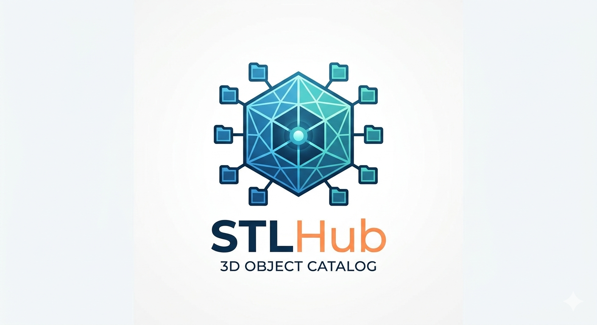
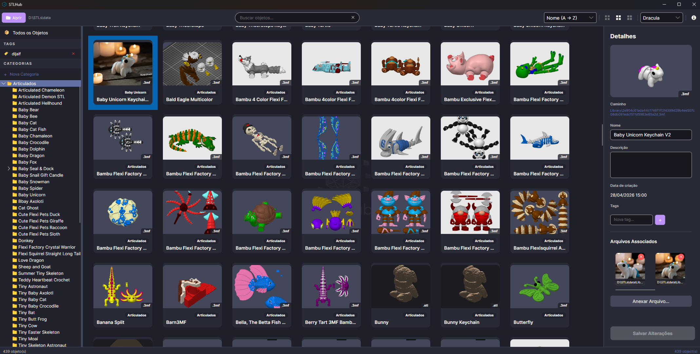

<p align="center">
  
</p>

<h1 align="center">STLHub</h1>

<p align="center">
  <strong>Organize, catalogue and find your 3D models in seconds.</strong>
</p>

<p align="center">
  
  
  
  
</p>

---

<p align="center">
  
</p>

## About

**STLHub** is an desktop application for managing large 3D object libraries. It lets makers, designers and engineers import, tag, search and organize `.stl`, `.3mf` and `.obj` files — so you never lose track of a model again.

## Features

- **Import files & folders** — drag and drop files or entire folder trees; folder structure is automatically mapped to hierarchical categories.
- **Automatic thumbnails** — preview images are generated in background for every imported model.
- **Full-text search** — find models instantly by name, description, tags or file name (powered by SQLite FTS5).
- **Hierarchical categories** — organize objects in a tree of categories and subcategories.
- **Tags** — assign multiple tags to any object for flexible cross-cutting classification.
- **Attachments** — associate images, G-code, PDFs, instructions and other files to each 3D object.
- **Duplicate detection** — file hashes prevent the same model from being imported twice.

## Download

<p align="center">
  <a href="https://github.com/jalf/stlhub/releases/latest">
    
  </a>
</p>

<p align="center">
  <em>Free and open source. Windows, Linux and macOS.</em><br>
  <em>Nothing else to install — no .NET, no dependencies, no account.</em>
</p>

### Windows — 3 steps

1. **[Download the installer](https://github.com/jalf/stlhub/releases/latest)** — on the release page, click the file named `STLHub-Setup-x.x.exe`.
2. **Run the file** you just downloaded and follow the wizard.
3. **Open STLHub** from the Start menu. Click **Abrir** to pick a folder where your library will live, then drag your 3D model folders onto the window.

> [!NOTE]
> Windows may show a blue **"Windows protected your PC"** screen when you run the installer. This happens because the installer is not code-signed (a paid certificate we don't have), **not** because anything is wrong with it. Click **More info** → **Run anyway** to continue.

Prefer not to install anything? Download `STLHub-win-x64.zip` instead, unzip it anywhere, and double-click `STLHub.exe` — it runs as-is and can be removed by deleting the folder.

<details>
<summary><strong>Linux and macOS</strong></summary>

<br>

Download the file for your system from the [latest release](https://github.com/jalf/stlhub/releases/latest):

| System | File |
|---|---|
| Linux | `STLHub-linux-x64.tar.gz` |
| macOS (Apple Silicon — M1/M2/M3/M4) | `STLHub-osx-arm64.tar.gz` |
| macOS (Intel) | `STLHub-osx-x64.tar.gz` |

Extract it and launch the app:

```bash
tar -xzf STLHub-*.tar.gz
chmod +x STLHub
./STLHub
```

On macOS, the app is not notarized, so Gatekeeper will refuse to open it on the first try. Remove the quarantine flag once and it will start normally:

```bash
xattr -d com.apple.quarantine STLHub
```

</details>

## Tech Stack

| Layer | Technology |
|---|---|
| UI Framework | [Avalonia UI](https://avaloniaui.net/) 12 |
| Runtime | .NET 10 |
| Database | SQLite + FTS5 |
| ORM / Data | Dapper + Microsoft.Data.Sqlite |
| MVVM | CommunityToolkit.Mvvm |
| Image Processing | SixLabors.ImageSharp |

## Building from Source

> Only needed if you want to modify STLHub. To simply use it, see [Download](#download) above.

Requires the [.NET 10 SDK](https://dotnet.microsoft.com/download/dotnet/10.0).

```bash
git clone https://github.com/jalf/stlhub.git
cd stlhub
dotnet build
dotnet run --project src/STLHub
```

## Project Structure

```
stlhub/
├── docs/               # Documentation & PRD
├── src/
│   └── STLHub/
│       ├── Converters/  # Value converters
│       ├── Data/        # Database access & initialization
│       ├── Models/      # Domain models (Object3D, Category, Tag…)
│       ├── Services/    # Business logic (LibraryManager, ThumbnailGenerator…)
│       ├── ViewModels/  # MVVM view models
│       └── Views/       # Avalonia XAML views
└── Scratch/             # Experimental / prototype code
```

## Data Model

```
Category  (Id, Name, ParentCategoryId, Path, SortOrder)
Object3D  (Id, Name, Description, MainFilePath, FileType, ThumbnailPath, Hash, CategoryId, CreatedAt)
Tag       (Id, Name)
ObjectTag (ObjectId, TagId)
Attachment(Id, ObjectId, FilePath, Type)
```

## Documentation

- [Usage Guide](docs/USAGE.md) — step-by-step instructions with video walkthroughs for importing, searching and managing your library.

## Roadmap

- [ ] AI-powered auto-tagging
- [ ] Cloud sync
- [ ] Thingiverse / Printables integration
- [ ] Model versioning

## License

This project is licensed under the MIT License.
